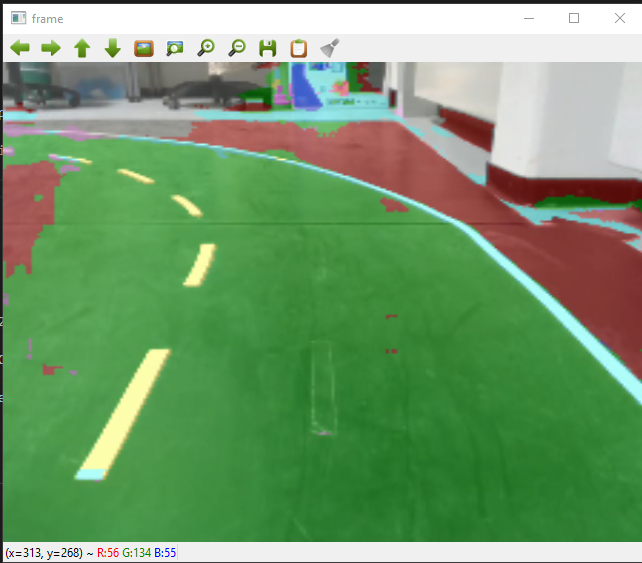

# ROAD AI

Semantische Segmentierung einer Straße. Das Netzwerk wurde zu 98% mit synthetischen Daten trainiert. 

[#img-thumbnail] 
.Example output of the network

## Training

Das Training kann entwerder lokal oder mit Hilfe von https://colab.research.google.com[Google Colab] ausgeführt werden. Hierfür stehen zwei IPython Notebooks zur Verfügung.

### Lokal

Das lokale Training erfordert einen PC mit einer NVIDIA GPU und CUDA-Unterstützung. Falls dies erfüllt ist, kann das Tranining mit den Notebook *train_local.ipynb* durchgeführt werden. Hierfür müssen die einzelenen Zellen der Reihe nach ausgeführt werden.

### Google Colab

Für das Training mit Colab muss der Code aus dem Notebook *train_colab.ipynb* nacheinandern in das Google Colab-Notebook kopiert werden. Damit das Tranining erfolgreich durchlaufen kann, müssen ein paar Modifikationen gemacht werden. Diese sind mit `@TODO` markiert.

## Inference

Um Inference auf einem Video laufen zu lassen, kann das Script *test.py* genutzt werden. Hierfür müssen zunächst der Video-Pfad, der Name der tranierten Netzes sowie die Bildauflösung angegeben werden.

Anschließend kann die Ausführung mit folgendem Befehl gestartet werden

    python test.py 

## Allgemeine Informationen

Farbcordierung und Klassenamen:

|===
| Klassen | Index | Farbe(RGB) 
| Background |0| (0,0,0)
| Drivable | 1 | (0,255,0)
| Non-drivable | 2 | (255,0,0)
| Hood | 3 | (0,0,255)
| Dashed centerline | 4 | (255,255,0)
| Lane-Marking | 5 | (0,255,255)
| Parking Area | 6 | (127,0,255)
| Double solid | 7 | (255,0,255)
| Stopline | 8 | (127,127,255)
| Parking lane | 9 | (255,0,127)
| Obstacle | 10 | (255,127,255)
|===

Im Ordner `data/binary_mask/` befinden sich die Masken als Binärbilder. Hierbei ist jedem Pixel der Wert der entsprechenden Klasse zugeordnet.
